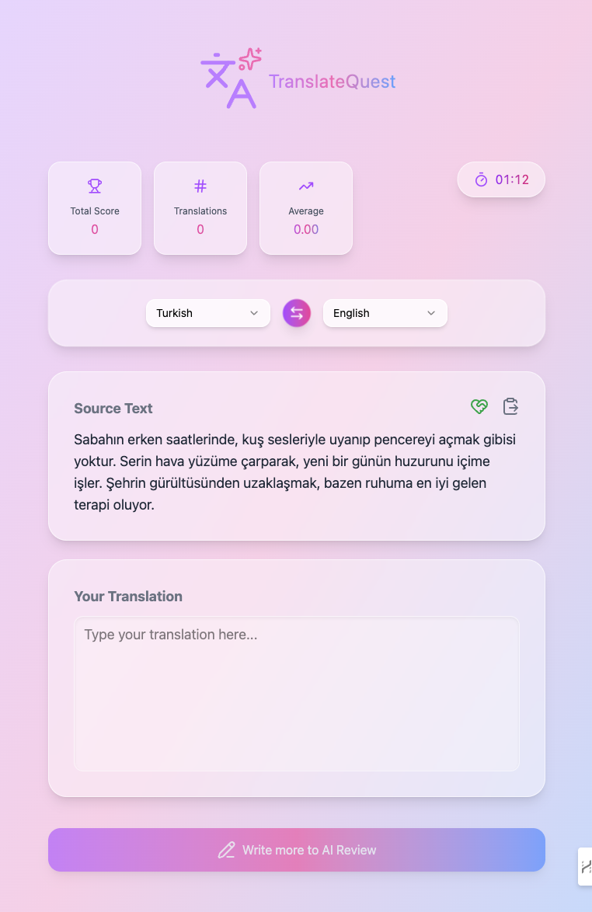

# 🎮 TranslateQuest — AI-Powered Translation Game

Visit: https://translate-quest.vercel.app/

## 🧩 Technologies Used
* React
* Typescript
* Gemini AI
* Tailwind Css
* Radix UI
* motion/react
* lucide-react
* Vercel Functions
* Vite

#### 🖼️ Screenshot


#### 🎥 YouTube Demo
[](https://youtu.be/ozOcyn1oYp0)

## ✨ Game Features
- 🌐 Multi-language support
- 🤖 AI-generated text for translation
- 💡 AI-suggested helper words and collocations
- 📋 Paste your own text for translation
- 📊 Total score, time, and average score tracking
- 🧠 AI Translation Review
  - Listing grammer errors
  - Listing improvement suggestions
  - Score and time feedback
  - Motivational review text

## ⚙️ Development Notes

### Accessing Environment Variables Locally
To use environment variables in Vite, prefix them with **VITE_**
Example:
> VITE_GEMINI_API_KEY=your_api_key_here

### 🔒 Using Vercel Serverless Functions to Protect Gemini API Key
To prevent exposing your Gemini API key, API requests are handled securely through **Vercel Functions.**
**To use vercel functions in localhost**: install `@vercel/node` package and command `vercel dev` instead of `npm run dev`
**Steps:**
1. Create an `api` folder in your project root (outside the `src` directory).
2. Inside it, create a file named `gemini.ts.`

Example:
```ts
import type { VercelRequest, VercelResponse } from '@vercel/node'
import { GoogleGenAI } from '@google/genai'

if (!process.env.GEMINI_API_KEY && !process.env.VITE_GEMINI_API_KEY) {
    console.error('Gemini API key not configured')
    throw new Error('Gemini API key not configured')
}

const genAI = new GoogleGenAI({
    apiKey: process.env.GEMINI_API_KEY || process.env.VITE_GEMINI_API_KEY
})

export default async function handler(req: VercelRequest, res: VercelResponse) {
  if (req.method !== 'POST') {
    return res.status(405).json({ error: 'Method not allowed' })
  }

  try {
    const { prompt } = req.body
    const response = await genAI.models.generateContent({
        model: 'gemini-2.5-flash',
        contents: prompt
    })

    res.status(200).json({ aiResponse: response.text } as AIResponse)
  } catch (error: any) {
    console.error(error)
    res.status(500).json({ error: error.message || 'Something went wrong' } as AIResponse)
  }
}
```

### 🧩 Gemini API Utility Function
This helper function is used in the UI to send secure requests to your Vercel endpoint.
```ts
export default async function gemini(prompt: string): Promise<AIResponse | never> {
    try {
      const response = await fetch(
        '/api/gemini',
        {
          method: 'POST',
          headers: { 'Content-Type': 'application/json' },
          body: JSON.stringify({ prompt })
        }
      )

      return await response.json() as AIResponse
    } catch (_) {
      throw new Error('Gemini api error!')
    }
}
```

### 🪟 Using Modals
Example of modal usage inside `App.tsx:`

```ts
return <>
    {/* ---*** Modals ***--- start --- */}
    {/* Review is coming animation */}
    <AIReviewAnimation open={reviewLoading} />
    {/* Text generating animation */}
    <TextGenerationAnimation open={isGeneratingText} />
    {/* Confirmation Dialog */}
    <ConfirmationBox
      open={confirmationBoxOpen}
      text={confirmationBoxText}
      onClose={(choice) => {
        if (choice === 'yes') handlePasteText(pasteText)
        setConfirmationBoxOpen(false)
      }}
    />
    {/* ---*** Modals ***--- end --- */}

    <main>
        ...
    </main>
</>
```

**🧱 Example Modal Component**
```ts
import clsx from "clsx"
import Modal from "./modal"
import { useEffect, useState } from "react"
import { motion } from "motion/react"

type Choice = 'yes' | 'no'

export default function ConfirmationBox(
    { open, text, onClose }: { open: boolean, text: string, onClose: (result: Choice) => void }
) {
    const [closing, setClosing] = useState<boolean>(false)
    const [isClosed, setIsClosed] = useState<boolean>(false)

    useEffect(() => {
        if (!open) {
            setClosing(true)

            const timer = setTimeout(() => {
                setIsClosed(true)
            }, 300)

            return () => clearTimeout(timer)
        } else {
            setIsClosed(false)
            setClosing(false)
        }
    }, [open])

    function handleChoice(choice: Choice) {
        onClose(choice)
    }

    if (isClosed || (!open && !isClosed)) return null

    return (
        <Modal>
            <motion.div
                className={clsx([
                    "w-8/12", "sm:w-6/12", "p-4", "rounded-lg", "m-auto", "shadow-lg",
                    "bg-white/40", "backdrop-blur-md", "border", "border-white/60"
                ])}
                animate={{ opacity: closing ? 0 : 1 }}
                transition={{ duration: 0.5, ease: "easeInOut" }}
            >
                <p className="text-xl font-bold text-gray-700 text-center">{text}</p>
                <div
                    className={clsx([
                        "flex", "justify-center", "items-center", "gap-2", "mt-4"
                    ])}
                >
                    <button
                        className={clsx([
                            "w-20", "p-2", "rounded-sm", "bg-green-600", "text-white",
                            "hover:bg-green-700", "cursor-pointer"
                        ])}
                        onClick={() => handleChoice('yes')}
                    >
                        Yes
                    </button>
                    <button
                        className={clsx([
                            "w-20", "p-2", "rounded-sm", "bg-red-600", "text-white",
                            "hover:bg-red-700", "cursor-pointer"
                        ])}
                        onClick={() => handleChoice('no')}
                    >
                        No
                    </button>
                </div>
            </motion.div>
        </Modal>
    )
}
```

**🪄 Base Modal Component (Blured, transparent, fixed positioned and screen-covered div):**
```ts
import clsx from "clsx"

export default function Modal({ children }: { children: React.ReactNode }) {
    return (
        <div className={clsx([
            "fixed inset-0 z-50 flex items-center justify-center bg-black/10 backdrop-blur-lg"
        ])}>
            {children}
        </div>
    )
}
```